  <!-- Dynamic Hero Banner (Switches automatically based on user's GitHub theme) -->
  <picture>
    <source media="(prefers-color-scheme: dark)" srcset="./assets/dark.svg">
    <source media="(prefers-color-scheme: light)" srcset="./assets/light.svg">
    
  </picture>

    

  <!-- Clean Profile Views Badge -->
  

 

  <h3>Software Engineer | AI & ML Specialist | Systems Architect</h3>
  
<em>Crafting robust, scalable full-stack systems and multi-agent AI platforms.</em>

---

### 🚀 Executive Summary

As a results-driven Software Engineer at **Spotline, Inc.**, I specialize in designing, developing, and deploying scalable full-stack systems and AI-powered applications in production environments. I blend creativity with deep technical expertise to architect robust software, from enterprise database validation suites to intelligent multi-agent automation systems.

- 🔭 **Currently Building:** Production-grade Agentic-RAG systems and V-Assure ScriptGen capabilities.
- 🌱 **Current Focus:** Advanced Multi-Agent Orchestration (LangGraph), LLMs, and Cloud Architecture (AWS/GCP).
- 👨‍💻 **Portfolio:** Discover my live projects and case studies at [surajkumaryadavin.vercel.app](https://surajkumaryadavin.vercel.app/).
- 📝 **Fun Fact:** Beyond the codebase, I'm a storyteller, sketcher, and writer. I believe in blending engineering precision with creative design.
- 📫 **Reach out:** [thesuraj396@gmail.com](mailto:thesuraj396@gmail.com)

---

### 🧠 Technical Arsenal

*(Icons dynamically generated for a unified, premium aesthetic)*

**Languages** 

**Frontend Development** 

**Backend & Databases** 

**AI, Machine Learning & Data Science** 

**Cloud, DevOps & Tools** 

---

### 📊 GitHub Analytics

  <!-- Top Languages Card configured to match the blue/navy theme -->
  
  
  <!-- Stats Card configured to match the blue/navy theme -->
  

  <!-- Streak Stats Card -->
  

---

### 🌐 Connect with Me

  
  
  
  
  
  

