  <h2 align="center">
    
  </h2>

 

  

 

  <table>
    <tr>
      <td align="center">
        
      </td>
      <td align="center">
        
      </td>
    </tr>
  </table>

 

  
   
  <a href="https://linkedin.com/in/surajyadav01"><code>[ LINKEDIN ]</code></a> •
  <a href="https://twitter.com/surajraizada6"><code>[ TWITTER ]</code></a> •
  <a href="https://kaggle.com/surajkumaryadav01"><code>[ KAGGLE ]</code></a> •
  <a href="https://www.leetcode.com/thesuraj01"><code>[ LEETCODE ]</code></a> •
  <a href="https://www.hackerrank.com/thesuraj396"><code>[ HACKERRANK ]</code></a> •
  <a href="https://instagram.com/surajkumaryadav.in"><code>[ INSTAGRAM ]</code></a> •
  <a href="https://surajkumaryadavin.vercel.app"><code>[ PORTFOLIO ]</code></a>

