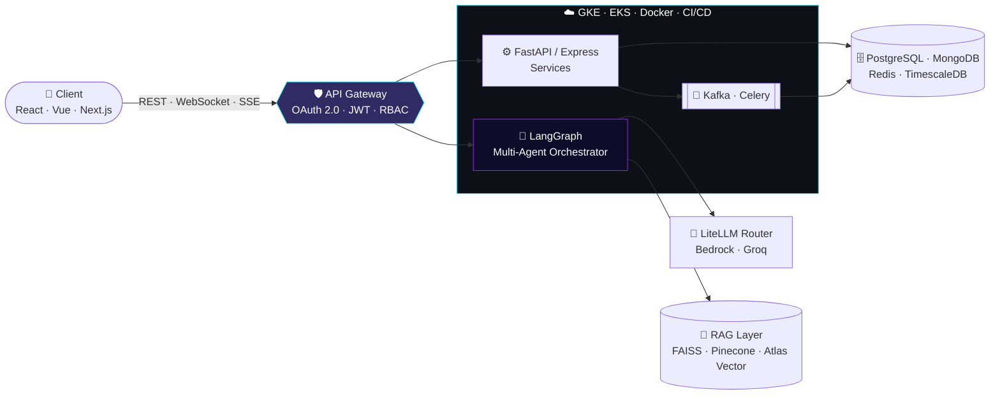

<!-- 
  ╔══════════════════════════════════════════════════════════════╗
  ║  SETUP: Find & replace  thesuraj01  and  Suraj Kumar Yadav        ║
  ║  Save as README.md in a repo named exactly like your username║
  ╚══════════════════════════════════════════════════════════════╝
-->

<div align="center">


<a href="https://git.io/typing-svg">
  
</a>

<br/>


</div>

---

## 🧬 `> whoami`

```python
class Engineer:
    def __init__(self):
        self.name        = "Suraj Kumar Yadav"
        self.role        = "Software Engineer · Full-Stack & AI Systems"
        self.experience  = "1+ year shipping to production"
        self.focus       = ["Distributed Systems", "Multi-Agent AI", "Secure Backends"]
        self.philosophy  = "Robust. Testable. Maintainable. Fast."
        self.mission     = "Drive impactful engineering at Google Payments"
        self.status      = "Open to opportunities 🟢"

    def ship(self, idea):
        return self.design(idea) | self.build() | self.review() | self.deploy()
```

> **Results-driven engineer** who designs, develops, and deploys scalable full-stack systems and AI-powered applications in production. I build **distributed, secure, high-performance** software: multi-agent AI orchestration platforms, enterprise database validation suites, and intelligent automation systems, leading projects end-to-end, running rigorous code reviews, and debugging complex system-level issues across the entire stack.

---

## ⚡ Core Capabilities

<table>
<tr>
<td width="25%" align="center">

### 🤖 AI Orchestration
Multi-agent systems, RAG pipelines, LLM routing & vector search

</td>
<td width="25%" align="center">

### 🏗️ System Design
Distributed, event-driven, real-time architectures at scale

</td>
<td width="25%" align="center">

### 🔐 Secure by Design
OAuth 2.0, JWT, RBAC, SSO & token encryption baked in

</td>
<td width="25%" align="center">

### 🧪 Engineering Rigor
Code review, validation suites, testable & maintainable code

</td>
</tr>
</table>

---

## 🛰️ Tech Arsenal

**Languages**


**Frontend**


**Backend & Real-Time**


**AI / ML**


**Data Layer**


**Cloud & DevOps**


**Security**


**Tools**


---

## 🌌 Architecture I Think In


```mermaid
flowchart LR
    U([👤 Client<br/>React · Vue · Next.js]) -- "REST · WebSocket · SSE" --> G{{🛡️ API Gateway<br/>OAuth 2.0 · JWT · RBAC}}
    G --> S1[⚙️ FastAPI / Express<br/>Services]
    G --> S2[🤖 LangGraph<br/>Multi-Agent Orchestrator]
    S2 --> L[🧠 LiteLLM Router<br/>Bedrock · Groq]
    S2 --> R[(🔎 RAG Layer<br/>FAISS · Pinecone · Atlas Vector)]
    S1 --> K[[📨 Kafka · Celery]]
    S1 --> D[(🗄️ PostgreSQL · MongoDB<br/>Redis · TimescaleDB)]
    K --> D
    subgraph Cloud ["☁️ GKE · EKS · Docker · CI/CD"]
        S1
        S2
        K
    end
    style G fill:#302b63,stroke:#24c6dc,color:#fff
    style S2 fill:#0f0c29,stroke:#8a2be2,color:#fff
    style Cloud fill:#0d1117,stroke:#24c6dc,color:#fff
```

---

## 🚀 What I Build

| 🛸 Domain | ⚡ What It Looks Like |
|:--|:--|
| **Multi-Agent AI Orchestration** | Stateful agent graphs with LangGraph, model routing via LiteLLM, hybrid retrieval (BM25 / TF-IDF / vector), schema-validated outputs with Pydantic |
| **Enterprise Database Validation Suites** | Rigorous, automated correctness checks across large-scale data systems, built for reliability and repeatability |
| **Intelligent Automation Systems** | Event-driven pipelines with Kafka & Celery, real-time streaming via WebSockets and SSE |
| **Secure Full-Stack Platforms** | End-to-end delivery from pixel to database with SSO, RBAC, and encrypted token handling |

---

## 🧭 Engineering Principles

```diff
+ Design for failure before you design for features
+ Security is a feature of the architecture, not a patch on top of it
+ If it isn't testable, it isn't done
+ Code review is how a team gets smarter, not just how bugs get caught
+ Own the project end-to-end, from the first diagram to the 3 AM dashboard
+ Simple systems scale; clever systems page you
```

---

## 📡 Live Telemetry

<div align="center">


<br/>


<br/><br/>


</div>

<details>
<summary><b>🐍 Contribution Snake (setup once, runs forever)</b></summary>

Add a workflow using [Platane/snk](https://github.com/Platane/snk) to generate the animation, then uncomment:

```md
<!--  -->
```

</details>

---

## 🎯 Current Mission

```yaml
target:        Google Payments
objective:     Build secure, scalable, high-performance financial infrastructure
bringing:
  - Full-stack depth (React → Node/FastAPI → Postgres/Mongo)
  - AI integration chops (agents, RAG, LLM routing)
  - Production instincts (GKE, Docker, CI/CD, observability mindset)
  - Security-first thinking (OAuth 2.0, JWT, RBAC, SSO)
  - Leadership: technical ownership, code review, cross-functional collaboration
status:        Ready to deploy 🚀
```

---

## 🤝 Soft Skills, Hard Impact


---

## 📬 Establish Connection

<div align="center">

[](https://linkedin.com/in/YOUR_LINKEDIN)
[](mailto:YOUR_EMAIL)
[](https://surajyadav.ai.studio)
[](https://github.com/thesuraj01)

<br/>

```text
┌──────────────────────────────────────────────────────┐
│  "The best way to predict the future is to build it" │
│                                      — Alan Kay      │
└──────────────────────────────────────────────────────┘
```


</div>